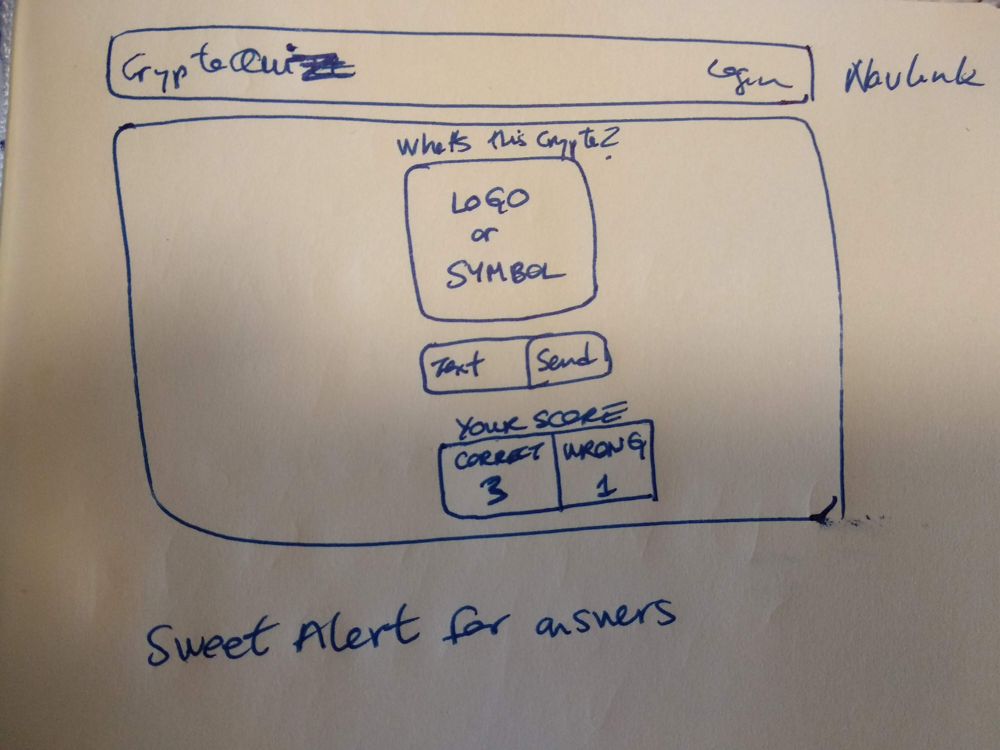
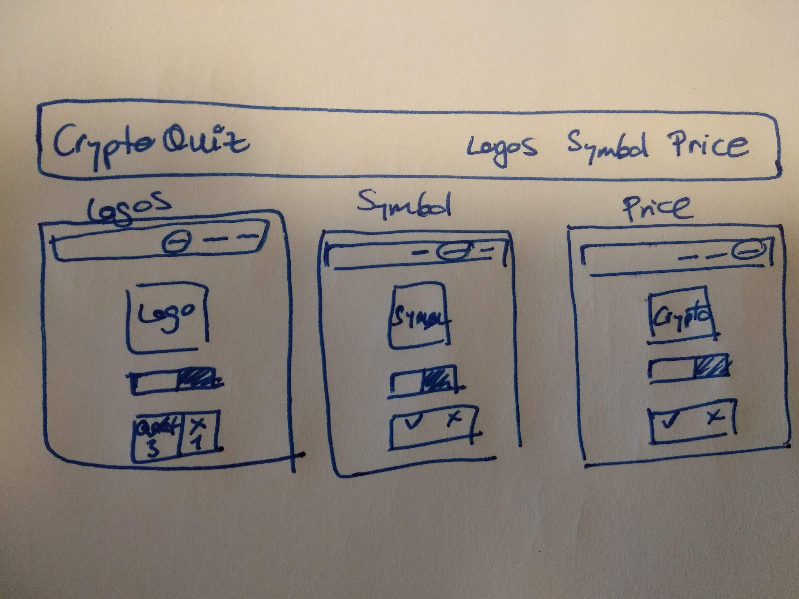

# CryptoQuiz

This project is an application to learn about cryptocurrencies in the best possible way: with a quiz!!

It has been developed using React, CSS3 and Axios. The API that has been used to gather the info is [Cryptocompare](https://www.cryptocompare.com/api#introduction)

## Notes for the Readers

This is an MVP develped by a Junior Javascript Developer in a short weekend. The stages of the development will be:

1. Static pages with routes
2. API request with axios
3. Directory page with the cryptos (Name, Symbol and image)
4. Ticker with prices
5. Quiz pages
   1. Symbols
   2. Logos
   3. Prices
6. Historic data playing

### Branches

The weekend was intense but I didn't achieve what I expected. There are 2 branches:

- **minimum**: it contains the latest version with the main working features and nice organization.
  - Currencies is only a static component that has to be conected to the API to show the different coins.
  - Quiz shows a coin with a symbol and the participant has to say the name of the coin.
- **dev**: it has all the things but needs to be organized and refactored. It's only for the developer.
  - Currencies: directory of currencies
  - Rollon: in order to learn better the aim is to have a carrusel of coins.
  - QuizLogo: from a logo guess the name of the crypto
  - QuizSymbol: from a symbol guess the name of the crypto
  - QuizPrice: from a Coin guess the aproximate price (within 5% error)
  - Ranking: shows the ranking of the player.

## Mockups

